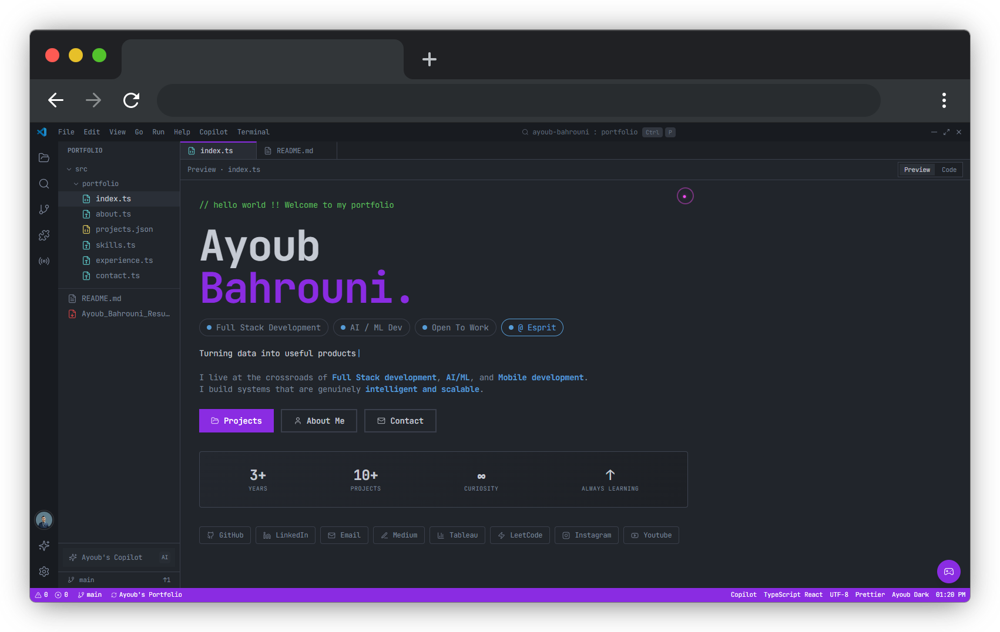

# AyoubOS - VSCode Inspired Developer Portfolio



An immersive VSCode-style portfolio experience featuring an AI Copilot, terminal emulator, command palette, extensions, themes, editor tabs, and interactive developer tooling.


<!-- Add a preview GIF or screenshot here when available. -->
<!--  -->

## Live Demo

[Portfolio Website](YOUR_URL_HERE)

## Overview

AyoubOS is a developer portfolio presented as a lightweight browser-based IDE. Instead of a static resume page, it gives visitors a familiar VSCode-inspired interface where they can explore files, projects, skills, contact information, a resume, extensions, and an interactive AI assistant.

The project is built as a React + Vite single-page application with a small Node/Vite API layer for Copilot requests. The UI is intentionally designed around developer workflows: opening files, switching tabs, running terminal commands, using a command palette, changing themes, and interacting with portfolio data as if it were a workspace.

## Features

- VSCode-inspired shell with title bar, activity bar, sidebar explorer, editor tabs, status bar, and bottom terminal panel.
- Interactive sidebar explorer with portfolio files such as `about.ts`, `projects.json`, `skills.ts`, `experience.ts`, `contact.ts`, and resume access.
- Terminal emulator with realistic command parsing, command history, autocomplete, clickable output, resume downloads, project navigation, and easter eggs.
- AI Copilot assistant that answers portfolio-focused questions and can trigger navigation actions such as opening projects, skills, contact, or resume sections.
- Command palette for fast keyboard-driven navigation and actions.
- Preview and code-style content modes for portfolio sections, making the site feel like a real editor workspace.
- Extensions system inspired by VSCode, including theme controls, font controls, notes, focus mode, AI mode, stats, search enhancements, animation settings, and game mode.
- Theme switching with persistent local storage and multiple editor-style visual themes.
- Animated project cards and UI transitions that preserve the developer-tool aesthetic.
- Custom cursor and optional UI sound feedback for a more playful interactive experience.
- Real editor tabs with open, close, active-tab, and multi-tab behavior.
- Fake file-system architecture that turns portfolio content into explorable files.
- Responsive layout designed to keep the experience usable across desktop and smaller screens.

## AI Copilot

The Copilot is a portfolio-aware assistant built into the right-side panel. It is designed to answer questions about Ayoub's background, skills, projects, resume, education, experience, and contact information without turning the portfolio into a generic chatbot.

Key capabilities:

- Uses a curated portfolio knowledge base from `src/data/portfolioKnowledge.ts`.
- Provides context-aware suggestions based on the active editor tab.
- Can perform navigation actions such as opening `projects.json`, `skills.ts`, `contact.ts`, or the resume.
- Streams responses with a typewriter-style interaction for a more natural assistant feel.
- Uses a theme-adaptive VSCode-style panel UI.
- Includes a server-side OpenRouter chat endpoint through `/api/chat` for production-style LLM integration.

The current Copilot UI is driven by curated portfolio knowledge for predictable, source-aware answers. The OpenRouter integration is handled server-side through `server/chat-handler.mjs`, keeping API keys out of client-side React code while providing request validation and rate limiting for deployments that connect the UI to the LLM endpoint.

## Terminal Emulator

The terminal is a developer-style portfolio CLI with a command parser and command map. It keeps the existing VSCode terminal aesthetic while making the portfolio explorable through commands.

Example commands:

```bash
whoami
skills
projects
contact
neofetch
npm install ayoub-resume
sudo hire ayoub
open pagepal
cat resume.pdf
llm --status
run ai-model
rm -rf bugs
```

Highlights:

- Command history with `ArrowUp` and `ArrowDown`.
- Lightweight autocomplete with `Tab`.
- Resume download commands.
- Project navigation commands.
- Clickable contact links.
- Clear error handling for unknown commands.
- Easter eggs that add personality without affecting performance.

## Extensions System

The extensions panel mirrors the feel of VSCode's extension marketplace while keeping the implementation lightweight and local to the portfolio.

Included extension-style modules:

- Theme Switcher for changing the visual theme.
- Font Settings for typography preferences.
- Language Settings for portfolio language preferences.
- Animation Control for motion preferences.
- Copilot Enhancer for assistant settings.
- Stats Panel for portfolio/project metrics.
- Game Mode for playful interactive behavior.
- Notes / Scratchpad with local persistence.
- Search Enhancer for navigation support.
- Focus Mode for distraction-free viewing.
- AI Mode for highlighting AI-related project context.

Most extension preferences are stored in `localStorage`, making the experience persistent without requiring a database.

## Tech Stack

### Frontend

- React 18
- TypeScript
- Vite
- Tailwind CSS
- React Router

### UI/UX

- Lucide React icons
- JetBrains Mono typography
- Tailwind CSS animations
- CSS custom properties for theme tokens
- Custom cursor and optional UI sound feedback

### AI

- OpenRouter API
- Server-side LLM request proxy available at `/api/chat`
- Portfolio-specific system prompt
- Curated local knowledge base for deterministic assistant behavior

### State and Architecture

- React local state for UI panels, tabs, command input, and assistant messages.
- React Context for click-sound preferences.
- `localStorage` for themes, extension settings, notes, language, font preferences, and sound preferences.
- Small Node HTTP server for serving production assets and handling `/api/chat`.

## Architecture

The app is structured around an IDE metaphor:

- `AppShell` owns the main workspace state, including active tab, open tabs, sidebar visibility, terminal visibility, extensions, Copilot, and focus mode.
- `EditorTabs` and `EditorContent` render the currently open portfolio file or extension page.
- `SidebarExplorer` presents portfolio content as a navigable file tree.
- `TerminalPanel` implements command parsing, command handlers, command history, autocomplete, and command output rendering.
- `Chatbot` provides the Copilot panel and maps user questions to portfolio knowledge, sources, and navigation actions.
- `ExtensionsPanel` exposes configurable extension-style features.
- `server/chat-handler.mjs` proxies OpenRouter requests and applies basic safeguards such as method checks, body validation, max message length, and rate limiting.

## Project Structure

```text
.
├── public/
│   └── Ayoub resume.pdf
├── server/
│   └── chat-handler.mjs
├── src/
│   ├── components/
│   │   ├── content/
│   │   ├── ActivityBar.tsx
│   │   ├── AppShell.tsx
│   │   ├── Chatbot.tsx
│   │   ├── CommandPalette.tsx
│   │   ├── EditorContent.tsx
│   │   ├── EditorTabs.tsx
│   │   ├── ExtensionsPanel.tsx
│   │   ├── SidebarExplorer.tsx
│   │   ├── TerminalPanel.tsx
│   │   └── TitleBar.tsx
│   ├── data/
│   │   ├── portfolio.ts
│   │   └── portfolioKnowledge.ts
│   ├── hooks/
│   │   ├── click-sound-context.ts
│   │   ├── click-sound-provider.tsx
│   │   └── use-click-sound.ts
│   ├── pages/
│   ├── test/
│   ├── App.tsx
│   ├── index.css
│   └── main.tsx
├── server.mjs
├── vite.config.ts
├── tailwind.config.ts
└── package.json
```

## Installation

### Prerequisites

- Node.js 18 or newer
- npm
- OpenRouter API key if you want to use the production Copilot API endpoint

### Setup

```bash
git clone <repository-url>
cd <repository-folder>
npm install
```

Create a local environment file:

```bash
cp .env.example .env
```

Add your OpenRouter key to `.env`:

```env
OPENROUTER_API_KEY=your_key_here
```

Start the development server:

```bash
npm run dev
```

The Vite dev server runs on port `8080` by default.

## Production Build

```bash
npm run build
npm start
```

`npm start` runs `server.mjs`, which serves the built `dist/` assets and exposes the `/api/chat` endpoint.

## Environment Variables

```env
OPENROUTER_API_KEY=your_key_here
PORT=8080
PORTFOLIO_URL=https://your-domain.example
```

Important security notes:

- Never commit real API keys to GitHub.
- Keep `.env` out of version control.
- Rotate any key that has been exposed publicly.
- Keep LLM calls server-side so secrets are never bundled into client JavaScript.

## Customization

### Update Portfolio Data

Edit the portfolio source files in `src/data/`:

- `src/data/portfolio.ts` controls sidebar files, social links, extension registry, project metadata, skills, and static chatbot responses.
- `src/data/portfolioKnowledge.ts` controls the Copilot knowledge base, assistant sources, project summaries, resume metadata, and contact details.

### Add or Edit Terminal Commands

Terminal commands live in `src/components/TerminalPanel.tsx` inside the command map. Add a new command by registering a handler that returns output, triggers navigation, downloads a file, or reports an error.

### Add Themes

Theme tokens are defined in `src/index.css` using CSS custom properties. Add a new `[data-theme="..."]` block, then register the theme in the settings UI.

### Customize Copilot Behavior

- Update local portfolio knowledge in `src/data/portfolioKnowledge.ts`.
- Adjust deterministic assistant routing in `src/components/Chatbot.tsx`.
- Update the OpenRouter system prompt in `server/chat-handler.mjs`.

### Change Extensions

- Update the extension registry in `src/data/portfolio.ts`.
- Edit extension panels under `src/components/content/extensions/`.
- Wire new extension tabs through `ExtensionPage.tsx` and the existing extension types.

### Update Resume

Replace `public/Ayoub resume.pdf` and keep the download filename consistent in resume-related code and data files.

## Screenshots

Add screenshots after deployment or when preparing the repository for public release.

### Home

<!--  -->

### Copilot

<!--  -->

### Terminal

<!--  -->

## Future Improvements

- Voice assistant for hands-free portfolio navigation.
- Multiplayer collaboration mode for shared portfolio walkthroughs.
- Plugin marketplace-style extension browsing.
- Real markdown editor for richer in-browser content editing.
- Live GitHub stats and repository activity widgets.
- AI-generated portfolio summaries tailored to recruiter, engineer, or founder personas.
- More terminal workflows, including guided project demos and command-based onboarding.
- Better screenshot and demo recording pipeline for repository documentation.

## About The Project

AyoubOS is inspired by VSCode, terminal workflows, and the way developers naturally explore technical systems. The goal is to turn a portfolio into an interactive product rather than a static page.

The experience combines storytelling with tooling: visitors can read the portfolio like a resume, inspect it like a codebase, query it through Copilot, or navigate it through terminal commands. This makes the project both a personal portfolio and a demonstration of frontend architecture, product thinking, AI integration, and interaction design.

## License

This project is released under the MIT License.

## Author

Ayoub Bahrouni

- GitHub: https://github.com/BahrouniAyoub
- LinkedIn: https://www.linkedin.com/in/ayoub-bahrouni
- Portfolio: YOUR_PORTFOLIO_URL
